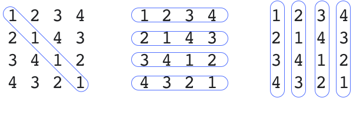

= CJ2020 Qual P1 - Vestigium

You get a set of square matrices as input. For each NxN matrix, calculate the sum of the values on the main diagonal, of all the columns and of all the rows. 

Then, output a line with three numbers: 
- k: the matrix trace (sum of the values on main diagonal)
- r: number of rows with repeated elements
- c: number of columns with repeated elements

For instance, for the matrix in the image the results are k=4, r=0, c=2 as there are no repeated elements nor in rows neither in cols. 

 

Description: https://codingcompetitions.withgoogle.com/codejam/round/000000000019fd27/000000000020993c[CodeJam 20, Qualification, Problem 1]

== Solution - Loop and sets

The problem can be decomposed in three simple subproblems.

To calculate the trace, we use a for loop in `i,j` that adds the numbers to the sum when i=j.

----
k=0
for i=0 to N
  k+= matrix[i][i]
----

To calculate the number of repeated  items in the rows, we performa a double loop using a set to track the number of unique items. 

----
r=0
for ri=0 to N
  set=[]
  for ci==0 to N
    set.add( matrix[ri][ci] )
  if set.size != N
    r++
----

To compute the number of repeated elements on columns, we proceed similarly to what we did with rows. 

== Impl

See my implementation in link:Solution.java[Java]

See also

* https://codingcompetitions.withgoogle.com/codejam/submissions/000000000019fd27/eGlhb3d1YzE[xiaowuc1] #1 in c++
* https://codingcompetitions.withgoogle.com/codejam/submissions/000000000019fd27/c2FtLnJlaW5laHI[sam.reinehr] #17 in Java
* https://codingcompetitions.withgoogle.com/codejam/submissions/000000000019fd27/a21vZA[kmod] #20 in python 2
* https://codingcompetitions.withgoogle.com/codejam/submissions/000000000019fd27/amVycnltYW8[jerrymao] #25 in python 3 and c++
* https://codingcompetitions.withgoogle.com/codejam/submissions/000000000019fd27/cHpm[pzf] #29 in python3

