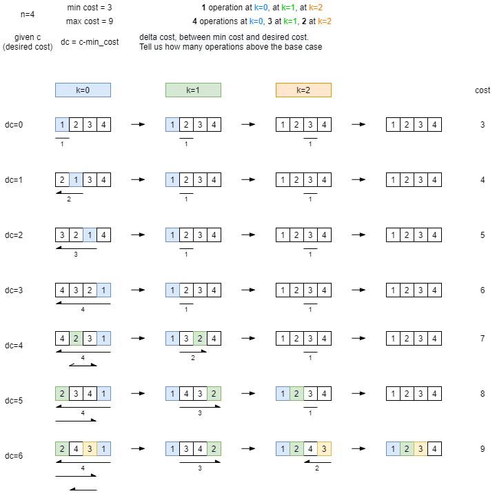

= CJ2021 Qual P1 - Reversort Engineering

https://codingcompetitions.withgoogle.com/codejam/round/000000000043580a/00000000006d12d7

Given 
* the algorithm to sort a list of distinct integers in increasing order from link:../p1[problem 1].
* A size N and a cost C. 

FIND a list of N distinct integers between 1 and N such that the cost of applying Reversort to it is exactly C, or say that there is no such list.

----
Reversort(L):
  for i := 1 to length(L) - 1
    j := position with the minimum value in L between i and length(L), inclusive
    Reverse(L[i..j])
----

== Idea

to tell if possible/impossible, we need to compute min cost and max cost given the lenght of the array. 

* min cost = N-1
* max cost = (N-1) + (N-2) + .. + 1

In case of an array already sorted, we need to perform only N-1 iterations. 

In case the array has the maximum sort cost, at the first iteration we need to reverse N-1 items, at the second iteration N-1, .., at the last iteration 1.

Given the a desired cost between min cost and max cost, we can build the matching array by planning in advance how many additional iterations we need compared to the base case. 

Below is a sketch of the idea with N=4

